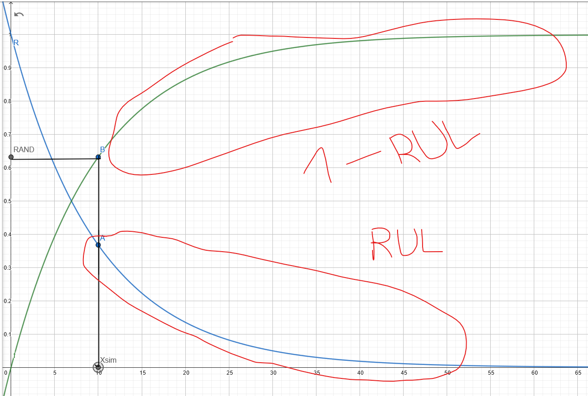

```{r exercice5-setup, message=FALSE, warning=FALSE, include=FALSE}
knitr::opts_chunk$set(cache = TRUE)
```

```{r exe5-library, include=FALSE}
library(ggplot2, warn.conflicts = FALSE) # Pour les graphiques
library(magrittr, warn.conflicts = FALSE) # Pour l'opérateur pipe : %>%
library(dplyr, warn.conflicts = FALSE) # Pour la manipulation de dataframe
```

```{r exercice5-clean-memory, message=FALSE, warning=FALSE, include=FALSE}
# Pour régler la génération aléatoire et conserver les mêmes
# valeurs à la compilation
set.seed(54684)

# Block de code pour effacer le contenu de la mémoire, utile à la compilation
rm(list = ls())
```

\newpage

# Exercice 5, Partie 2.

## Présentation du problème

Dans cette partie on étudie un système composé de quatres ampoules en série.
On considère les ampoules $iid$ suivant une loi de Weibull avec $\eta = 3an$
(paramètre d'échelle) et $\beta=2.5$ (paramètre de forme).

Dans ce cas on a :
$$
R_i(t)= e^{-\left(\frac{t}{\eta}\right)^\beta} ; \forall i \in [1;4]\\
R_{sys} (t) = \prod_{i=1}^{4}R_i(t)=
\prod_{i=1}^{4}e^{-\left(\frac{t}{\eta}\right)^\beta}=
e^{-\sum_{i=1}^4 \left(\frac{t}{\eta}\right)^\beta}
=e^{-4\left(\frac{t}{\eta}\right)^\beta}=
e^{-\left( \frac{t}{4^{-\frac{1}{\beta}}\eta} \right)^\beta}
$$

Théroiquement, le système suit une loi de Weibull de paramètre :
$\eta_{sys} = 4^{-\frac{1}{\beta}}\eta = \frac{\eta}{4^{-\frac{1}{\beta}}}$ (paramètre d'échelle) et $\beta_{sys} = \beta$
(paramètre de forme).

Dans ce cas on a :
$$
MTTF_{sys} = \eta_{sys}\Gamma(1+\frac{1}{\beta_{sys}}) =
\frac{\eta}{4^{-\frac{1}{\beta}}} \Gamma(1+\frac{1}{\beta})
$$

On a aussi le résultat théorique : $T_{sys} = min(T_i|i=1...4)$ car le système
est en série.

## Simulation du système

On peut commencer par créer les fonctions permettant de simuler le système et vérifier
le résultat théorique trouvé plus haut.

```{r}
# Simulation d'une réalisation de la loi de Weibul de paramètre
# thêta et beta
# remplace la fonction rweibull() de R

realisation_aleatoire_weibull <- function(scale = 3, shape = 2.5) {
    
    # Simulation d'une réalisation de la loi de Weibul de paramètre
    # thêta et beta
    # remplace la fonction rweibull() de R
    
    scale * (-log(runif(1)))^(1/shape) %>% return()
}

realisation_panne_système <- function(n = 4, scale = 3, shape = 2.5) {
    
    # Simulation aléatoire d'une date de panne du système
    
    replicate(n = n,
              realisation_aleatoire_weibull(scale = scale, shape = shape)) %>%
        min() %>%
        return()
}

realisation_panne_système <- function(n = 4, scale = 3, shape = 2.5) {
    list_simu <- c()
    for (i in 1:n) {
        list_simu <- c(list_simu,
                       realisation_aleatoire_weibull(scale = scale,
                                                     shape = shape))
    }
    return(min(list_simu))
}
```

```{r}
# Calcul théorique du MTTFsys
sprintf("MTTFsys théorique calculé : %f ans",
       4^(-1/2.5) * 3 * gamma(1 + 1/2.5))

# Simulation d'un MTTF :
sprintf("Une simulation du MTTFsys : %f ans",
        mean(replicate(100000,
                       realisation_panne_système())))
```

On trouve des résultat cohérent ce qui me donne confiance dans mon modèle théorique.

## Optimisation de la politique de maintenance

On va ensuite appliquer la politique de maintenance suivante :

- Après une panne, une maintenance corrective d'un coût $cmc=10000€$ est effectuée
remettant à neuf l'ensemble du système.
- Si le système fonctionne un temps $x$ sans être maintenu, on effectue une maintenance
préventive d'un coût $cmp = 1500€$ qui remet à neuf le système.

On cherche alors le $x*$ qui minimise le coût total.

On déterminera ce $x*$ en utilisant la même logique que dans l'exercice 5, partie 1.

```{r}

realisation_trajectoire_sys <- function(param, info = FALSE) {
    
    # Fonction pour simuler une trajectoire du système et
    # retourner le coût total.
    # param est un argument de type list() de la forme :
    # param = list(H,x,scale,shape,cmp,cmc)
    
    # Attention :
    # H, scale et x sont en jours
    
    # les dates de maintenance préventives prévues
    echeancier <- param$x * 1:floor(param$H/param$x)
    if (info) {
        #debug
        print("=== l'échéancier de maintenance préventive ===")
        print(echeancier)
        print("=== Début de simulation ===")
    }
    # Le temps courant
    t <- 0
    
    # Cout final actuel
    Cf <- 0
    
    i <- 1 # un indice
    
    while (t < param$H & i < length(echeancier)) {
        
        next_panne <- t + realisation_panne_système(n = param$n,
                                                    scale = param$scale,
                                                    shape = param$shape)

        if (info) {
            # debug
            print(paste("Temps courant",t))
            print(paste("Date de la prochaine panne : ",next_panne))
            print(paste(
                "Date de la prochaine maintenance préventive : ",
                echeancier[i]))
        }
        
        if (next_panne < echeancier[i]) {
            # Dans ce cas la prochaine panne si on laisse vivre le système
            # arrive avant la prochaine maintenance préventive
            # donc on effectue la maintenance corrective
            
            if (info) {print("MC")}
            
            # on met à jour le temps courant
            t <- next_panne
            # on effectue une maintenance corrective
            Cf <- Cf + param$cmc
        } else {
            
            if (info) {print("MP")}
            
            # on effecute la maintenance préventive avant une survenue de panne
            t <- echeancier[i]
            i = i + 1
            # on effectue une maintenance préventive
            Cf <- Cf + param$cmp
        }
        
        if (info) {
            print(paste("Temps courant",t))
            print(paste("Coût actuel",Cf))
            print(paste("val de i",i))
            print("---")
        }
    }
    
    return(Cf)
}

compute_mean_cost_by_time <- function(p = 10000, param_sys) {
  
    # Calcul un coût moyen par unité de temps Cinf(x)
    # On chaque trajectoire est divisée par H, l'horizon de simulation
  
    frame <- c()
    
    for (i in 1:p) {
        frame <- c(frame,
                   realisation_trajectoire_sys(param = param_sys,
                                               info = FALSE))
    }
    
    frame <- mean(frame/param_sys$H)
    return(frame)
}

plot_mean_cost_evolution <- function(list_x, param, p = 1000) {
  list_simu <- c()
  for (x in list_x) {
    param$x <- x
    list_simu <- c(list_simu,
                   compute_mean_cost_by_time(p = p,
                                             param_sys = param))
  }
  
  ggplot() +
    geom_line(aes(x = list_x, y = list_simu)) +
    labs(x = "Périodicité des maintenances",
         y = "Coût moyen simulé",
         title = "Évolution du coût moyen simulé suivant x")
}
```

On peut commencer par effectuer une simulation de la trajectoire du système :

```{r}
parametres <- list(H = 1000, # on observe sur 1000 ans
                   x = 1, # on effectue une maintenance préventive tous les
                   # ans car on a un MTTF de 1.5 environ
                   n = 4, # nombre de composants
                   scale = 3, # eta en jours
                   shape = 2.5, # sans unités
                   cmc = 10000, # euros
                   cmp = 1500) # euros
realisation_trajectoire_sys(parametres)
```

On a donc un coût de 3 788 500€, soit un coût moyen de 378,85€ par ans.

On peut ensuite calculer le coût moyen par ans avec ce système et ce jeux de
paramètre donné :
- une maintenance préventive après 1 ans de fonctionnement,
- $cmc=10000€$
- $cmp = 1500€$
- $n=4$, 4 composants en série
- $\eta = 3$, $\beta = 2.5$

```{r}
sprintf("Coût moyen pour x = %d an : %f",
        parametres$x,
        compute_mean_cost_by_time(p = 1000, parametres))
```

Attention, avec $p=1000$, je ne calcule le coût moyen qu'à partir de 1000 simulation
ce qui est peu mais réduit grandement le temps de calcul.

On va ensuite simuler le coût moyen par ans en faisant varier la valeur de $x$
pour trouver graphiquement la valeur optimale $x*$.

```{r}
x_values <- seq(1,5,0.5)
parametres <- list(H = 1000, # on observe sur 1002 ans
                   x = 0, # on effectue une maintenance
                   #préventive tous les x ans
                   n = 4,
                   scale = 3, # eta en jours
                   shape = 2.5, # sans unités
                   cmc = 1000, # euros
                   cmp = 200) # euros
plot_mean_cost_evolution(list_x = x_values, param = parametres)
```

On peut observer sur le graphe que le coût optimal semble se trouver à moins d'un ans

```{r}
x_values <- seq(1/12,14/12,1/12)
parametres <- list(H = 1000, # on observe sur 1002 ans
                   x = 0, # on effectue une maintenance
                   #préventive tous les x ans
                   n = 4,
                   scale = 3, # eta en jours
                   shape = 2.5, # sans unités
                   cmc = 1000, # euros
                   cmp = 200) # euros
plot_mean_cost_evolution(list_x = x_values, param = parametres)
```
Le minimum semble être atteint vers $x^* \simeq 0.8an$ soit $9.6mois$.

```{r}
x_values <- seq(8/12,11/12,1/24)
parametres <- list(H = 1000, # on observe sur 1002 ans
                   x = 0, # on effectue une maintenance
                   #préventive tous les x ans
                   n = 4,
                   scale = 3, # eta en jours
                   shape = 2.5, # sans unités
                   cmc = 1000, # euros
                   cmp = 200) # euros
plot_mean_cost_evolution(list_x = x_values, param = parametres)
```

Il semble que la valeur optimale de $x$ est $x^* = 0.875ans$ soit $10.5mois$.

## Modèle théorique avec maintenance minimale

On se place maintenant dans un cas de maintenance minimale. Quand un composant (une des ampoules) tombe en panne à une date $s$, il est instantanément
remit en marche mais son état est inchangé.

Les composants agissent donc selon une loi de Weibull avec maintenance
minimale ce qui correspond à un processus de poisson non Homogène (NHPP).

Après une panne à un instant $s$ on cherche à simuler la prochaine date
de panne.

Dans le cas initial pour simuler une date de panne d'un composant, on
utilisait une simulation par méthode de la transformée inverse sur $F$ :
$$
x_{sim} = F^{-1}(RAND) \space ; \space RAND \sim U[0,1]
$$

Dans notre cas on cherche à simuler un temps de fonctionnement avant la panne
sachant que la composant à vécu un temps $s$ avant une première panne.

On pourrait appliquer cette logique de la transformée inserve sur $F$ avec
la survie $R(t)$. On aurait alors :

$$
x_{sim} = R^{-1}(RAND) \space ; \space RAND \sim U[0,1]
$$

Le résultat serait le même par symétrie axiale entre $R$ et $F$.

Si le système si l'un cherche la loi du composant après un temps de vie
de $s$ on observe alors $RUL(t,s)=P(T>t+s|T>s)$ puisque avec une
loi uniforme sur $[0,1]$, on a $P(X>s) = P(X<1-s)$

Pour simuler un nouveau temps de panne après une durée de fonctionnement
de $s$ on va alors calculer la fonction inverse du $RUL$ : $RUL(t,s)^{-1}$
(ou la fonction inverse de $(1-RUL(t,s)))$, ce qui est équivalent).



Dans le cas d'un composant de loi de Weibull on a :
$$
RUL(t,s) = P(T>t+s|T>s) = \frac{P(T>t+s \cap T>s)}{P(T>s)} \\
RUL(t,s) = \frac{e^{-(\frac{t+s}{\eta})^\beta}}
{e^{-(\frac{s}{\eta})^\beta}} =
e^{(\frac{s}{\eta})^\beta}e^{-(\frac{t+s}{\eta})^\beta}\\
RUL^{-1}(t,s)=\eta \left( 
(\frac{s}{\eta})^{\beta}-ln(t)\right)^{\frac{1}{\beta}}-s
$$

On va donc avoir :
$$
x_{sim} = RUL^{-1}(RAND,s)= \eta \left( 
(\frac{s}{\eta})^{\beta}-ln(RAND)\right)^{\frac{1}{\beta}}-s
$$

avec $x_{sim}$ une durée de fonctionnement simulée après la réparation minimale effectuée à $s$.

On peut donc créer une fonction $RUL(t,s)$ :

```{r}
realisation_aleatoire_rul <- function(s, scale = 3, shape = 2.5) {
    return(
        scale * ((s/scale)^(shape)-log(runif(1)))^(1/shape) - s
    )
}
```

On peut alors simuler deux pannes successives d'un composant :

> Attention : la date de la seconde panne est égale à :
$s+RUL^{-1}(RAND,s)$ avec $s$ simulée aléatoirement.

```{r}
s <- realisation_aleatoire_weibull(scale = 3, shape = 2.5)
sprintf("Date première panne : %f ans", s)
sprintf("Date seconde panne : %f ans",
        s + realisation_aleatoire_rul(s, scale = 3, shape = 2.5))
```

On peut ensuite créer une fonctionne qui simule $k$ panne de suite pour le
composant :

```{r}
realisation_k_panne_composant <- function(k = 2,
                                          scale = 3,
                                          shape = 2.5) {
    if (k == 1) {
        realisation_aleatoire_weibull(scale = scale,
                                      shape = shape) %>%
            return()
    } else {
        dates_pannes <- c(
            realisation_aleatoire_weibull(scale = scale,
                                          shape = shape)
        )
        for (i in 2:k) {
            dates_pannes <- c(
                dates_pannes,
                dates_pannes[i-1] + 
                    realisation_aleatoire_rul(s = dates_pannes[i-1],
                                          scale = scale,
                                          shape = shape)
            )
        }
        
        return(dates_pannes)
    }
}
```

On peut alors simuler 10 instants de panne successif pour un même
composant avec maintenance minimale :
```{r}
pannes <- realisation_k_panne_composant(k = 10, scale = 3, shape = 2.5)

x <- seq(0,10,0.01)
ggplot() +
    geom_line(aes(x,pweibull(x, shape = 2.5, scale = 3))) +
    geom_point(aes(x = pannes,
                   y = pweibull(pannes, shape = 2.5, scale = 3)),
               color = 'red',
               shape = 3,
               size = 4)
```

On voit que les pannes sont de plus en plus fréquentes au fur et à mesure
que le système vieillit et il faut le "remettre en route" de plus en
plus fréquemment.

## Nouvelle politique de maintenance

Dans cette politique de maintenace, la maintenance corrective ne remplace que l'ampoule
défectueuse.

Dans ce cas on effectue une maintenance préventive que si **aucune ampoule** ne tombe en
panne pendant une période $x$.

Dans ce cas il faut changer en partie la technique de simulation. Il faut modifier
la fonction `realisation_trajectoire_sys`

```{r}
realisation_trajectoire_sys_2 <- function(param, info = FALSE) {
  
    # Le temps courant
    t <- 0
    # Cout final actuel
    Cf <- 0
    i <- 1 # un indice
    
    if (info) {
        print("=== Début de simulation ===")
    }
    
    # On simule les dates de panne des composants
    pannes_composants <- replicate(
        param$n,
        t + realisation_aleatoire_weibull(param$scale,
                                          param$shape)
    )
    
    # la prochaine date de maintenance prev
    date_maintenance_prev <- t + param$x
    
    while (t < param$H) {
        
        if (info) {
            # debug
            print(paste("Temps courant",t))
            print(paste("Date de la prochaine panne : ",next_panne))
            print(paste(
                "Date de la prochaine maintenance préventive : ",
                echeancier[i]))
        }
        
        if (next_panne < echeancier[i]) {
            # Dans ce cas la prochaine panne si on laisse vivre le système
            # arrive avant la prochaine maintenance préventive
            # donc on effectue la maintenance corrective
            
            if (info) {print("MC")}
            
            # on met à jour le temps courant
            t <- next_panne
            # on effectue une maintenance corrective
            Cf <- Cf + param$cmc
        } else {
            
            if (info) {print("MP")}
            
            # on effecute la maintenance préventive avant une survenue de panne
            t <- echeancier[i]
            i = i + 1
            # on effectue une maintenance préventive
            Cf <- Cf + param$cmp
        }
        
        if (info) {
            print(paste("Temps courant",t))
            print(paste("Coût actuel",Cf))
            print(paste("val de i",i))
            print("---")
        }
    }
    
    return(Cf)
}
```

